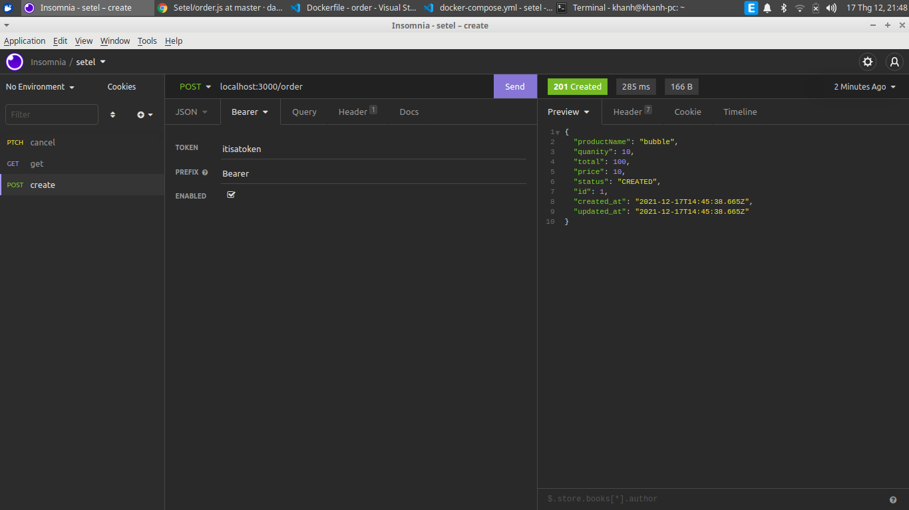
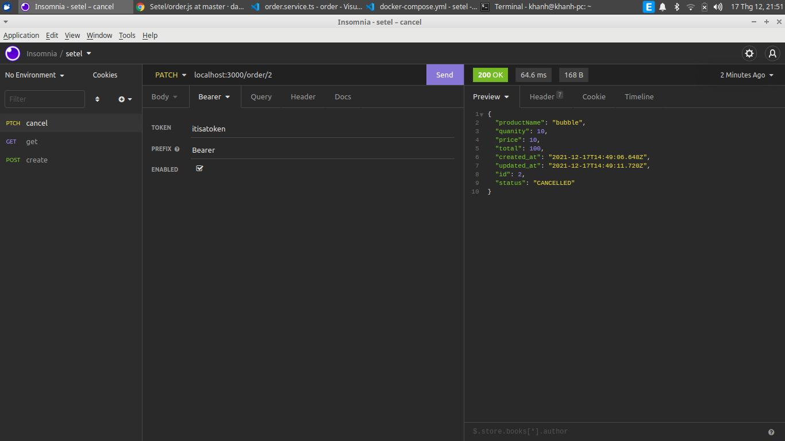

# Tech stack
NestJS, Postgres, RabbitMQ

`order` <-> `task queue` <-> `payment`

# Installation using Docker
## Build order service image
```bash
docker build -t setel-order ./order
```
## Build payment service image
```bash
docker build -t setel-payment ./payment
```
## Start system
```bash
docker-compose up -d
```

# Using
## Create order

Make a `post` request to `localhost:3000/order` with body like bellow:
```json
{
	"productName": "bubble",
	"quanity": 10,
	"total": 100,
	"price": 10
}
```
and don't forget `Authorization` token: `Bearer itisatoken`.\
The `payment` service will check if `quantity` * `price` = `total`, then the payment request will be approved. otherwise, it won't be.
## Cancel order

Make a `patch` request to `localhost:3000/order/{order id}` which includes `Authorization` token: `Bearer itisatoken`.
## Get order
Make a `get` request to `localhost:3000/order/{order id}` which includes `Authorization` token: `Bearer itisatoken`.

# E2E test
In testing enviroment, please provide a Postgres instance running on port `5433` and a runing RabbitMQ instance.